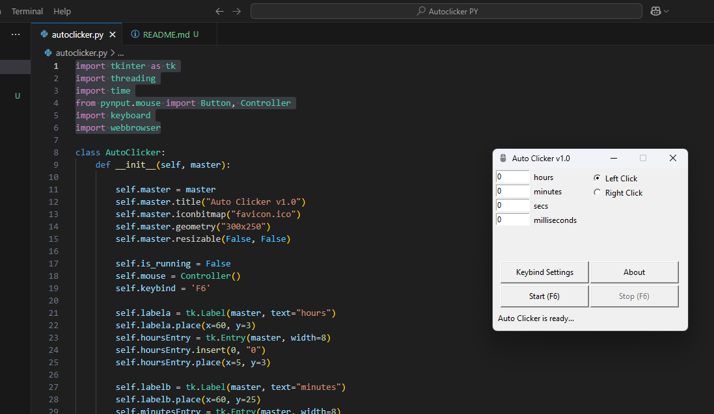

# Autoclicker

A simple autoclicker thats open-source. Supposed to act like OP Auto Clicker but with my own touch to it.



## Usage

Before you try running it, here are the libraries that you need to install first:

```
pip install pynput
pip install keyboard
```

The libaries that are included in this autoclicker are **tkinter**, **threading**, **time**, **pynput**, **keyboard**, and **webbrowser**.